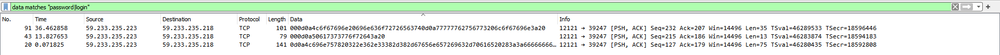

# Level 02

As `level02` if we run `ls` we see that a `level02.pcap` file is present in the home directory. [.pcap](https://www.reviversoft.com/en/file-extensions/pcap) files contains network traffic: **data packets**. These files are used to determine network status, allowing analyzers to attend to problems that may have occurred on the network and allowing them to study data communications.

We'll use [Wireshark](https://www.wireshark.org/), probably the best known `.pcap` reader out there to look into this file. After downloading it we'll need to extract that file outside from the virtual machine to work with it.

```shell
  $>  scp -P 4242 level02@<VM-IP>:level02.pcap .
````

> Using [`scp`](https://linux.die.net/man/1/scp), we can copy a file from another machine through ssh. In this case, the file called `level02.pcap` located inside `level02` home directory on `<VM-IP>`<sup>1</sup> via port `4242`.

Then we only have to load this file inside **Wireshark** to see a list of packets that were sent back and forth between multiple machines. As we can see there is a lot packets so we can problably set a filter for keywords such as **login** or **password** in the data field of each packet.

Nothing easier that than simply type this following filter in the Wireshark searchbar:

```
  data matches "login|password"
```

Only three packets seems like it's related to a ssh connection to the VM.



We can now follow the TCP flux of one of these three packets to get the full connexion attempt logs. For this, right click on one of them and **Follow** > **TCP Flux**. It opens a new window containing this following data:

```
..%..%..&..... ..#..'..$..&..... ..#..'..$.. .....#.....'........... .38400,38400....#.SodaCan:0....'..DISPLAY.SodaCan:0......xterm.........."........!........"..".....b........b....	B.
..............................1.......!.."......"......!..........."........"..".............	..
.....................
Linux 2.6.38-8-generic-pae (::ffff:10.1.1.2) (pts/10)

..wwwbugs login: l.le.ev.ve.el.lX.X
..
Password: ft_wandr...NDRel.L0L
.
..
Login incorrect
wwwbugs login: 
```

Since it is displayed as ASCII by default some non-printable characters are replaced by a `.` like [`hexdump`](https://man7.org/linux/man-pages/man1/hexdump.1.html). We can switch output to Hexdump format and then we get this for the password section:

```
000000B9  66                                                 f
000000BA  74                                                 t
000000BB  5f                                                 _
000000BC  77                                                 w
000000BD  61                                                 a
000000BE  6e                                                 n
000000BF  64                                                 d
000000C0  72                                                 r
000000C1  7f                                                 .
000000C2  7f                                                 .
000000C3  7f                                                 .
000000C4  4e                                                 N
000000C5  44                                                 D
000000C6  52                                                 R
000000C7  65                                                 e
000000C8  6c                                                 l
000000C9  7f                                                 .
000000CA  4c                                                 L
000000CB  30                                                 0
000000CC  4c                                                 L
000000CD  0d                                                 .
```

If we refer to the [ASCII Table](https://www.asciitable.com/), `7f` means **delete** and `0d` **return** so the password should be `ft_waNDReL0L` for user `flag02`. We can now get our flag for next level.

```shell
  $> su flag02
  Password: ft_waNDReL0L

  $> getflag
  Check flag.Here is your token : kooda2puivaav1idi4f57q8iq
```

So, `kooda2puivaav1idi4f57q8iq` is the flag for this level.

<sup>1</sup> : This is a placeholder that you should replace by the IP you can retrieve via running `ifconfig` inside the VM.